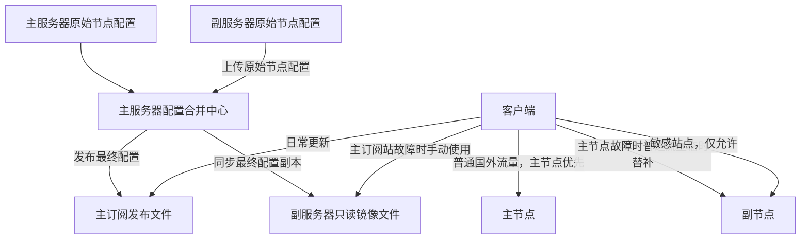
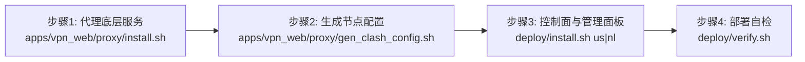

# 🚀 VPS Xray 部署、Clash 双机订阅合并与分发系统

本仓库用于管理和部署基于两台 VPS 主机（美国主服务器 ➕ 荷兰副服务器）的“一主一副”多节点 Clash 代理订阅合成、安全分发与高可用镜像分发系统。同时集成了 Flask 订阅管理面板、Telegram-QQ 桥接服务及消息静默转发 Bot。

---

## 文档导航

| 文档 | 内容 |
|---|---|
| [系统架构](docs/ARCHITECTURE.md) | 双节点职责、数据流和故障转移 |
| [部署指南](docs/DEPLOYMENT.md) | 主副服务器从零部署 |
| [日常运维](docs/OPERATIONS.md) | 更新、同步、回滚和健康检查 |
| [安全规范](docs/SECURITY.md) | Token、SSH 和文件权限 |
| [故障排查](docs/TROUBLESHOOTING.md) | 节点、订阅和同步问题 |
| [订阅系统说明](deploy/clash-sub/README.md) | 配置合并与镜像机制 |
| [Web 面板](apps/vpn_web/README.md) | Flask 面板部署 |
| [Bot 服务](apps/tg_bot/README.md) | Telegram 与 QQ 服务 |

---

## 1. ⚙️ 系统整体架构

本系统采用“一主一副”物理级分流架构。客户端日常更新指向美国主订阅站，当美国主站不可用时，可随时手动改用荷兰镜像站。



---

## 2. 📡 服务器角色划分

| 服务器 | 角色 | 公网域名 | 核心职责 |
| :--- | :--- | :--- | :--- |
| **美国** | 主服务器 | `us-sub.example.com` | 默认代理、最终配置提取合并、主发布、Nginx、Flask 面板、Bot 节点 |
| **荷兰** | 副服务器 | `nl-sub.example.com` | 敏感 AI 网站代理、订阅只读物理镜像备用下载站、主动推送本地节点 |

---

## 3. 🎯 流量分流与故障策略

系统设置了非对称的故障转移路由分流：
*   **普通国外流量** ➡️ 优先走 **美国节点**。
*   **OpenAI / ChatGPT / Claude / Gemini / Perplexity** ➡️ 强制走 **荷兰节点**。
*   **中国大陆网站** ➡️ **DIRECT (直连)**。
*   **故障逻辑**：
    *   **美国节点故障**：普通国外流量将自动临时切换至 **荷兰节点**；美国节点恢复后，自动切回美国。
    *   **荷兰节点故障**：敏感站点强制连接失败（使用 `REJECT`），**不得**回落走美国或 DIRECT 直连，避免敏感大模型账号被风控封禁。

---

## 4. 📂 项目仓库目录结构

```text
Xray_portal/
├── README.md                         # 本自述文件
├── .env.example                      # 环境变量配置模板
├── .gitignore                        # Git 忽略规则
├── .editorconfig                     # 代码缩进与编码格式规范
│
├── apps/                             # 🖥️ 应用源码模块
│   ├── tg_bot/                       # 机器人应用
│   │   ├── tg_bot.py                 # 消息转发 Bot
│   │   ├── bridge_bot.py             # QQ-TG 桥接 Bot
│   │   ├── fetch_link.py             # 并发下载引擎
│   │   ├── requirements.txt          # Python 依赖包
│   │   └── README.md                 # Bot 服务使用说明
│   │
│   └── vpn_web/                      # Web 管理控制台
│       ├── proxy/                    # Xray 引擎一键安装与元配置生成脚本
│       ├── web/                      # Flask 前端面板代码 (含 app.py, utils.py)
│       ├── requirements.txt          # Python 依赖包
│       └── README.md                 # Web 控制台部署说明
│
├── deploy/                           # 📦 一键自动化部署框架与运维脚本
│   ├── install.sh                    # 一键自动化部署命令行入口 (<us|nl> --env <file>)
│   ├── verify.sh                     # 部署后自动化状态自检与语法校验脚本
│   ├── remote-deploy.sh              # 远程 SSH 自动化推送一键构建脚本
│   ├── install-peer-key.sh           # 双机互连 SSH 公钥受限注入工具
│   ├── lib/                          # 核心功能组件库 (common/env/ssh-keys/install-us/install-nl)
│   ├── env/                          # 角色专属环境变量模板 (us.env.example / nl.env.example)
│   ├── nginx/                        # Nginx 配置文件与 SSL 模板
│   ├── systemd/                      # 机器人与 Flask 面板的 systemd 守护配置文件
│   ├── clash-sub/                    # 订阅合成核心逻辑
│   │   ├── us/                       # 美国端：节点合并 (extract_merge.py) 与重建脚本
│   │   ├── nl/                       # 荷兰端：主动上传 (push) 与只读初始化脚本
│   │   └── README.md                 # 订阅合成机制与 SSH 权限控制文档
│   └── examples/                     # 密钥与受限授权 authorized_keys 的示范占位符
│
└── scripts/                          # 🛠️ 仓库辅助脚本
    ├── validate-project.sh           # 项目语法、Nginx/Systemd 格式及关联性自动校验工具
    ├── check-secrets.sh              # 敏感私钥、密码和 Token 提防泄漏扫描工具
    └── README.md                     # 开发辅助验证说明
```

---

## 5. 🚀 完整系统部署顺序与一键指南

在全新的 VPS 上搭建完整的可用节点，遵循如下执行时序（也可使用 `--with-proxy` 一次完成全套安装）：



### 5.1 美国主控制服务器 (`us` 角色) 完整安装
你可以通过 `--with-proxy` 参数一站式完成 **翻墙代理引擎 + 订阅分发中心 + Web 管理面板** 的全链条安装：

```bash
git clone <YOUR_GIT_URL>
cd Xray_portal
cp deploy/env/us.env.example .env
chmod 600 .env
nano .env  # 填写您的主服务器公网域名、IP 及控制台密码等

# 方案 A (推荐)：一站式组合安装（自动先装 Xray 翻墙代理，再装面板与控制面）
sudo ./deploy/install.sh us --env .env --with-proxy

# 方案 B：按次序分阶段执行
#   1) sudo ./apps/vpn_web/proxy/install.sh
#   2) sudo ./apps/vpn_web/proxy/gen_clash_config.sh
#   3) sudo ./deploy/install.sh us --env .env

# 执行部署自检与验证
./deploy/verify.sh us --env .env
```

### 5.2 荷兰备用与 AI 分流节点 (`nl` 角色) 完整安装
荷兰端同样支持 `--with-proxy` 一站式装配节点与只读订阅镜像站：

```bash
git clone <YOUR_GIT_URL>
cd Xray_portal
cp deploy/env/nl.env.example .env
chmod 600 .env
nano .env  # 仅需填写荷兰公网域名/IP 与订阅 TOKEN

# 一次性安装荷兰代理节点服务 + 备用只读订阅分发系统
sudo ./deploy/install.sh nl --env .env --with-proxy
./deploy/verify.sh nl --env .env
```

> **提示**：多机打通 SSH 双向推送互连的密钥配置及机器人扩展服务部署步骤，详见 [系统部署指南 (DEPLOYMENT.md)](docs/DEPLOYMENT.md)。


---

## 6. 🔒 安全与开发规范

*   **不要提交任何真实私钥或凭据**：在向 Git 仓库提交前，请务必运行 `./scripts/check-secrets.sh` 扫描。
*   **保持脚本规范性**：在提交前，请运行 `./scripts/validate-project.sh` 进行基础语法编译校验。
*   **许可证**：
    ```text
    License 尚未指定。
    ```
