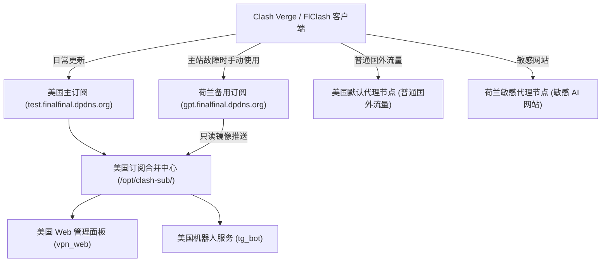

# 🚀 VPS Xray 部署、Clash 双机订阅合并与分发系统

本仓库用于管理和部署基于两台 VPS 主机（美国主服务器 ➕ 荷兰副服务器）的“一主一副”多节点 Clash 代理订阅合成、安全分发与高可用镜像分发系统。同时集成了 Flask 订阅管理面板、Telegram-QQ 桥接服务及消息静默转发 Bot。

---

## 1. ⚙️ 系统整体架构

本系统采用“一主一副”物理级分流架构。客户端日常更新指向美国主订阅站，当美国主站不可用时，可随时切换到荷兰镜像站。



---

## 2. 📡 服务器角色划分

| 服务器 | 角色角色 | 公网域名 | 核心职责 |
| :--- | :--- | :--- | :--- |
| **美国** | 主服务器 | `test.finalfinal.dpdns.org` | 默认代理、最终配置提取合并、主发布、Nginx、Flask 面板、Bot 节点 |
| **荷兰** | 副服务器 | `gpt.finalfinal.dpdns.org` | 敏感 AI 网站代理、订阅只读物理镜像备用下载站、主动推送本地节点 |

---

## 3. 🎯 流量分流与故障策略

系统设置了精细的路由分流，且**不配置任何跨国负载均衡或 fallback**：
*   **普通国外流量** ➡️ 强制分流到 **美国节点**。
*   **OpenAI / ChatGPT / Claude / Gemini / Perplexity** ➡️ 强制分流到 **荷兰节点**。
*   **中国大陆网站** ➡️ **DIRECT (直连)**。
*   **故障逻辑**：
    *   荷兰代理节点故障时，敏感站点直接失败，**不得**回落走美国（保护大模型账号免遭跨地区风控封禁）。
    *   美国代理节点故障时，普通国外网站失败，**不得**自动改走荷兰。

---

## 4. 📂 项目仓库目录结构

```text
Xray_portal/
├── README.md                         # 本自述文件
├── .env.example                      # 环境变量配置模板
├── .gitignore                        # Git 忽略规则
├── .editorconfig                     # 代码缩进与编码格式规范
│
├── apps/                             # 🖥️ 应用源码模块
│   ├── tg_bot/                       # 机器人应用
│   │   ├── tg_bot.py                 # 消息转发 Bot
│   │   ├── bridge_bot.py             # QQ-TG 桥接 Bot
│   │   ├── fetch_link.py             # 并发下载引擎
│   │   ├── requirements.txt          # Python 依赖包
│   │   └── README.md                 # Bot 服务使用说明
│   │
│   └── vpn_web/                      # Web 管理控制台
│       ├── proxy/                    # Xray 引擎一键安装与元配置生成脚本
│       ├── web/                      # Flask 前端面板代码 (含 app.py, utils.py)
│       ├── requirements.txt          # Python 依赖包
│       └── README.md                 # Web 控制台部署说明
│
├── deploy/                           # 📦 生产环境部署模板与脚本
│   ├── nginx/                        # Nginx 配置文件与 SSL 模板
│   ├── systemd/                      # 机器人与 Flask 面板的 systemd 守护配置文件
│   ├── clash-sub/                    # 订阅合成核心逻辑
│   │   ├── us/                       # 美国端：节点合并 (extract_merge.py) 与重建脚本
│   │   ├── nl/                       # 荷兰端：主动上传 (push) 与只读初始化脚本
│   │   └── README.md                 # 订阅合成机制与 SSH 权限控制文档
│   └── examples/                     # 密钥与受限授权 authorized_keys 的示范占位符
│
└── scripts/                          # 🛠️ 仓库辅助脚本
    ├── validate-project.sh           # 项目语法、Nginx/Systemd 格式及关联性自动校验工具
    ├── check-secrets.sh              # 敏感私钥、密码和 Token 提防泄漏扫描工具
    └── README.md                     # 开发辅助验证说明
```

---

## 5. 🚀 快速开始与部署流程

要在一套全新的美国 + 荷兰服务器中完整运行本系统：

1.  **克隆项目并准备本地环境**：
    ```bash
    git clone <YOUR_GIT_URL>
    cd Xray_portal
    cp .env.example .env
    # 编辑 .env 文件填入 Token 与面板登录密码
    ```
2.  **详细部署步骤**：
    *   关于系统的网络与安全边界，请阅读：[系统架构说明](file:///home/elite/Myself/Xray_portal/docs/ARCHITECTURE.md)。
    *   关于从零开始部署主副服务器的操作，请阅读：[部署指南](file:///home/elite/Myself/Xray_portal/docs/DEPLOYMENT.md)。
    *   关于日常维护（节点重装、合成、同步），请阅读：[日常运维手册](file:///home/elite/Myself/Xray_portal/docs/OPERATIONS.md)。
    *   关于系统文件权限与 SSH 安全控制，请阅读：[安全规范文档](file:///home/elite/Myself/Xray_portal/docs/SECURITY.md)。
    *   关于连接不通或 404 等错误的诊断，请阅读：[排障诊断手册](file:///home/elite/Myself/Xray_portal/docs/TROUBLESHOOTING.md)。

---

## 6. 🔒 安全与开发规范

*   **不要提交任何真实私钥或凭据**：在向 Git 仓库提交前，请务必运行 `./scripts/check-secrets.sh` 扫描。
*   **保持脚本规范性**：在提交前，请运行 `./scripts/validate-project.sh` 进行基础语法编译校验。
*   **许可证**：
    ```text
    License 尚未指定。
    ```
