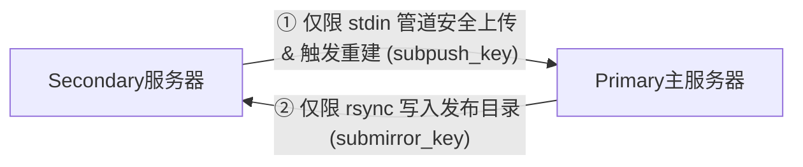

[返回项目首页](../README.md) ·
[系统架构](ARCHITECTURE.md) ·
[部署指南](DEPLOYMENT.md) ·
[日常运维](OPERATIONS.md) ·
[安全规范](SECURITY.md) ·
[故障排查](TROUBLESHOOTING.md)

# 📐 系统架构说明书 (`docs/ARCHITECTURE.md`)

本系统采用精心设计的“一主一副”多节点物理分流和高可用订阅镜像架构，旨在提供高性能、地域出口稳定、凭据强隐蔽性以及抵御局部单点故障的代理分发环境。

---

## 1. 服务器职责边界

系统将业务划分为两台服务器协作：
*   **Primary主服务器 (`primary-sub.example.com` - 核心大脑)**：
    *   作为**默认代理出口**，承接除敏感大模型网站以外的全部日常国外流量。
    *   作为**订阅合成中心**，安全解析两端的原始 Clash 配置文件，合并节点与核心分流规则，生成最终订阅文件。
    *   作为**服务承载体**，对外托管 Flask 订阅控制台网页、消息转发和桥接 Bot。
*   **Secondary副服务器 (`secondary-sub.example.com` - 镜像与专用出口)**：
    *   作为**敏感代理出口**，专用于承接 OpenAI/ChatGPT, Claude, Gemini, Perplexity 等对 IP 地域和检测极其严格的敏感网站流量。
    *   作为**只读备用站**，只读保存Primary推送的最终 `clash.yaml` 配置，主站断网时供用户手动切换下载。

---

## 2. 客户端流量路径与分流规则

为防止因共享登录、支付或验证码组件导致出口混乱，我们设定了以下流量路径：

```text
普通国外网站流量           ──>   【Primary节点 (PRIMARY-MAIN)】
OpenAI/Claude/AI Studio  ──>   【Secondary节点 (SECONDARY-SENSITIVE)】
中国大陆域名/IP            ──>   【DIRECT (直连)】
```

### 为什么不配置负载均衡与自动 Fallback？
1.  **敏感站点出口国家必须保持物理级稳定**：
    *   如果将Secondary设置为Primary普通流量的自动 fallback，或在Secondary故障时将敏感站点自动回落至Primary，会导致 OpenAI 流量突然从Primary IP 传出，这在触发大模型的严苛风控审计时极易导致账号封禁。
    *   因此，当Secondary节点不可用时，敏感站点直接失败，**绝对不自动 fallback 切换回Primary节点**。
2.  **不设置基于 ping/url-test 的自动切换**：
    *   敏感站点的 IP 变化可能引来风控系统警觉。

---

## 3. 配置提取与订阅合成流程

合成中心在后台自动执行以下数据流向：

### 3.1 原始节点流向 (从两端收集)
*   **Secondary端** ➡️ 运行上传脚本 ➡️ 使用 `subpush` 单向安全复制至Primary的 `incoming/` 目录中。
*   **Primary端** ➡️ 本地快照复制，将Primary的原始 `clash.yaml` 复制到 `sources/primary-full.yaml`。

### 3.2 合并生成与发布
1.  解析两端 YAML 文件，安全提取其中 `proxies` 节点。
2.  将提取到的远程代理节点名称进行固定和重命名：
    *   Primary节点命名为 `PRIMARY-MAIN-1`, `PRIMARY-MAIN-2`...
    *   Secondary节点命名为 `SECONDARY-SENSITIVE-1`, `SECONDARY-SENSITIVE-2`...
3.  加载基础 Mihomo 模板，生成对应的 `DEFAULT-PRIMARY`, `SENSITIVE-SECONDARY` 和 `MANUAL` 代理组，并生成由上而下的精细分流路由规则。
4.  进行 YAML 解析与 `mihomo -t` 内核格式双重校验，校验通过后原子替换发布。
5.  通过受限 SSH 强推回Secondary副站物理目录中落盘存储。

---

## 4. 双向数据流向拓扑

```text
数据流 1：Secondary节点原始配置向Primary收集
[Secondary /var/www/clash/clash.yaml]
       │
       ▼ (通过安全 stdin 管道传输 upload-secondary)
[Primary /opt/clash-sub/incoming/secondary-full.yaml.ready]
       │
       ▼ (验证成功后 mv 提升)
[Primary /opt/clash-sub/sources/secondary-full.yaml] ──> 【Python 合成最终订阅】

-------------------------------------------------------------

数据流 2：Primary最终订阅向Secondary镜像同步
[Primary /opt/clash-sub/published/clash.yaml]
       │
       ▼ (通过 rsync submirror_key)
[Secondary /var/www/sub/<SUB_TOKEN>/clash.yaml] (物理副本落盘)
```

---

## 5. 单向 SSH 受限安全凭证模型

两台服务器互联不使用 root 互信，而是使用两个系统级的受限低权限账户：



### 5.1 Secondary向Primary上传配置 (`subpush` 账户)
*   **私钥持有**：Secondary服务器持有 `subpush_key` 私钥。
*   **安全限制**：Primary端在 `subpush` 账户的 `authorized_keys` 中配置 `restrict` 并绑定 `subpush-cmd-wrapper` 强指令过滤器。只允许其通过标准输入上传配置（`upload-secondary`）和执行 `rebuild` 唤醒命令；`upload-secondary` 仅作为 deprecated/legacy 兼容入口。

### 5.2 Primary向Secondary同步订阅 (`submirror` 账户)
*   **私钥持有**：Primary服务器持有 `submirror_key` 私钥。
*   **安全限制**：Secondary端在 `submirror` 账户的 `authorized_keys` 中配置 `restrict` 凭证限制，只允许 rsync 进程向指定的备用只读镜像目录写入 `clash.yaml`。

该模型保证了密钥泄漏风险处于完全隔离状态。

---

[返回 README](../README.md)
